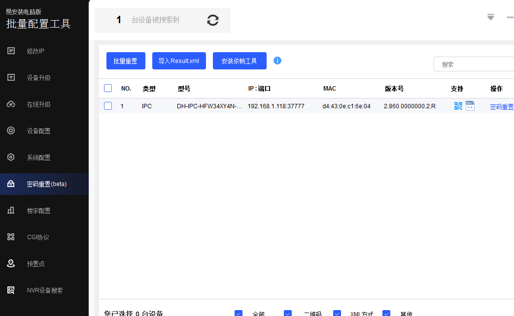
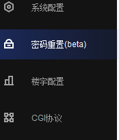
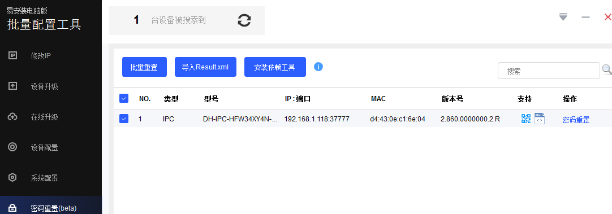
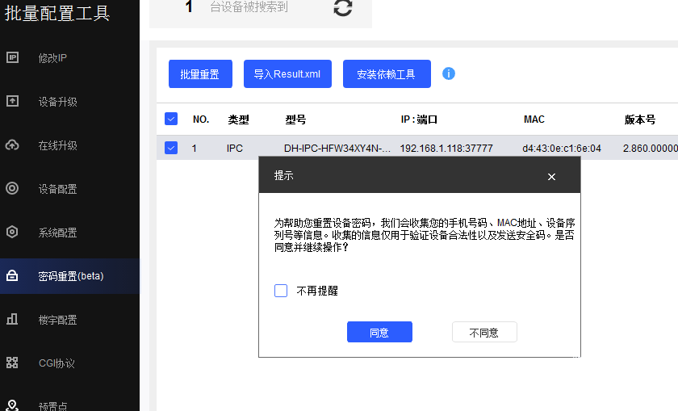
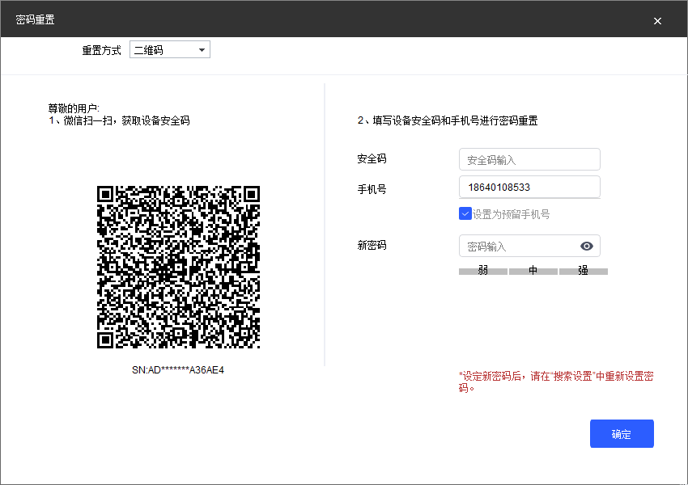
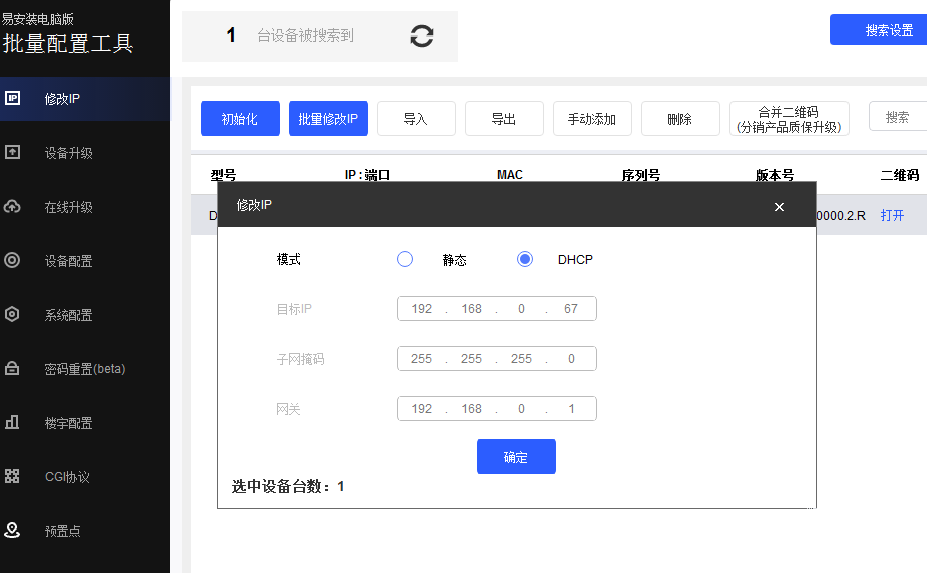

# 大华摄像机忘记密码恢复教程

本文介绍大华摄像机忘记密码后的恢复方法，共6个步骤。

## 步骤1：运行大华工具软件

运行大华工具软件，易安装电脑版

## 步骤2：点击密码恢复键

点密码恢复键

## 步骤3：点击密码重置

点密码重置

## 步骤4：扫描二维码

用微信扫描生成的二维码

## 步骤5：修改摄像机IP

密码恢复后，修改摄像机IP

## 步骤6：测试与恢复出厂设置

IP修改好之后，可用网页端或大华云商APP测试并恢复出厂设置

---

> **提示**：操作完成后建议记录新密码，避免再次遗忘。